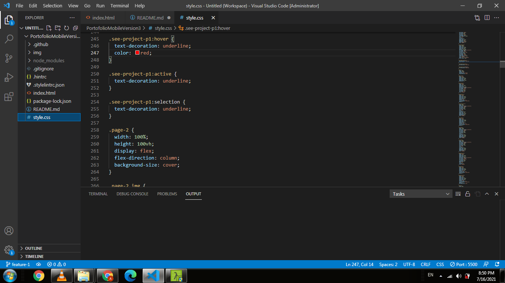

# PortofolioMobileVersion3
## Project Name
 This is the secound part of a continues website development project which depend on a very good website calld figma.

 This project is designed for as students at Microverse to get knowledge on responsive design and how to use flex box.

css part example:-

## Built With

- html,css
- git and git hub

## Authors

👤 Addisalem Seifu

- GitHub: [@addisalemseifu](https://github.com/githubhandle)
- Twitter: [@Addisalem Seifu](https://twitter.com/twitterhandle)
- LinkedIn: [addisalem seifu](https://linkedin.com/in/linkedinhandle)

## 🤝 Contributing

Contributions, issues, and feature requests are welcome!

## Show your support

Give a ⭐️ if you like this project!

## 📝 License
@Addisalem Seifu , Microverse
